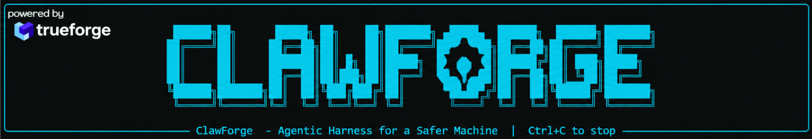

# ClawForge

### From terminal → agentic harness.

**ClawForge is an open-source harness for running, observing, and controlling agentic workloads on your machine.**



It evolves from a security-focused terminal into a layer that an internal agentic system can operate through, powered by [TrueForge](https://github.com/truefoundry/trueforge).

---

## The Problem

Modern agents can **write and execute code**, but there is a missing layer between the agent and the machine.

You need somewhere to:

- Run untrusted or generated code safely.
- See what processes that code starts.
- See which ports and network connections it opens.
- Understand what is actually happening on the machine.
- Decide whether a process or connection is suspicious.
- Let an agent investigate the system instead of blindly executing commands.
- Stop before an action can cause real damage.

Most existing tooling solves only one piece of this.

You have terminals that execute commands, sandboxes that isolate code, and system monitors that show processes or connections — but there is no simple, open-source **agentic layer that brings these capabilities together**.

---

## What is ClawForge?

ClawForge provides that layer.

```text
                    ⚡ CLAWFORGE
                  Agentic Harness
                         │
                  ┌──────▼──────┐
                  │  TrueForge  │
                  │             │
                  │ Agents      │
                  │ Sessions    │
                  │ Subagents   │
                  │ Approvals   │
                  └──────┬──────┘
                         │
                  ┌──────▼──────┐
                  │   ClawNet   │
                  │             │
                  │ Sandbox     │
                  │ Processes   │
                  │ Network     │
                  │ Policy      │
                  │ Actions     │
                  └──────┬──────┘
                         │
                         ▼
                      Machine
```

### ClawForge lets an agent:

**Run**

Execute code inside an isolated environment rather than directly on the host.

**Observe**

Inspect processes, ports, connections, filesystem activity, and execution behavior.

**Reason**

Ask questions such as:

> *Which processes currently running on my machine look suspicious?*

> *What opened this connection?*

> *Which process is listening on this port?*

> *What did this code actually do when executed?*

**Control**

Take actions through ClawNet's policy and security layer.

**Stop**

Pause before sensitive or irreversible actions and require human approval.

---

## Architecture

ClawForge is not a separate agent platform sitting beside ClawNet.

**ClawNet is becoming the harness.**

TrueForge provides the agentic orchestration primitives, while ClawNet provides the machine-level capabilities and security boundaries.

```text
Agent
  │
  ▼
TrueForge
  │
  ├── Sessions
  ├── Subagents
  ├── Tool orchestration
  └── Approval checkpoints
  │
  ▼
ClawNet
  │
  ├── Network monitoring
  ├── Process inspection
  ├── Sandbox execution
  ├── Policy engine
  ├── Behavioral analysis
  └── Security actions
  │
  ▼
Machine
```

The agent **does not directly control the machine**.

---

## Quickstart

Requires Windows, Python 3.10+, Node 22.14+, an OpenAI API key, and a sandbox: a **Daytona** API key (primary, `DAYTONA_API_KEY`) and/or Docker Desktop (fallback).

```bash
python -m venv .venv && .venv\Scripts\activate
pip install -r core/requirements.txt
copy .env.example .env                       # set OPENAI_API_KEY

# terminal 1 — the agent harness (installs TrueForge into .trueforge/ on first run)
python -m clawforge trueforge                # http://localhost:8790

# terminal 2 — ClawNet's capabilities as MCP tools
python -m clawforge serve                    # http://127.0.0.1:8765/mcp (bearer token)

# terminal 3 — the ClawForge console: status checks, first-run setup, then chat with the agent
python -m clawforge
```

`python -m clawforge trueforge` is used instead of `npx @truefoundry/trueforge`. On Windows, npm 11's `npx` install lock times out on a package this size (`npm error code ECOMPROMISED` / `Lock compromised`). The command also allowlists the local MCP host (`OUTBOUND_URL_ALLOWED_HOSTS`), because TrueForge blocks loopback MCP URLs by default.

One-shot mode: `python -m clawforge run "Which processes look suspicious? Contain anything that is."`

You can also open the TrueForge chat UI, pick the `clawforge` agent, and approve with **Allow / Deny** there. `clawnet forge <cmd>` works the same way as `python -m clawforge <cmd>`.

## Where it stops

Each ClawNet capability is an MCP tool. The approval line is set by the tool's MCP annotations, which TrueForge enforces:

| Tier | Tools | Gate |
|---|---|---|
| **Observe** (read-only) | `system_status`, `list_connections`, `suspicious_processes`, `inspect_process`, `who_is_listening`, `explain_pid`, `lookup_evidence`, `threat_intel`, `recent_decisions`, `preview_action`, `list_sandbox_runs`, `sandbox_report` | runs autonomously |
| **Execute** (Daytona sandbox, Docker fallback) | `sandbox_run_code`, `sandbox_run_path`, `sandbox_clone` | runs autonomously in an ephemeral Daytona sandbox (local Docker if Daytona is unavailable): quarantined copy only, decoy credentials, canary secrets, host env never forwarded |
| **Control** (changes the host) | `kill_process`, `suspend_process`, `block_ip`, `quarantine_file`, `close_port`, `promote_sandbox_run` | **human approval on every call** |

The gate has several layers:

1. Control tools are annotated `destructiveHint` **and** named explicitly in `require_approval_for_tools`.
2. Before a control action is proposed, `preview_action` measures its guardrail result and blast radius. The CLI shows that briefing again at the approval prompt, re-measured locally rather than taken from the agent's word.
3. After a human approves, ClawNet's guardrails still run and can refuse: protected processes, private IPs, System32 files, or a failed chain-of-trust step.
4. The MCP server only listens on localhost and requires a bearer token, so only the registered TrueForge connector can reach it.
5. Every verdict, approval, refusal and action is appended to `~/.clawnet/decisions.jsonl`.

Machine-sourced strings (process names, paths, sandbox output) go through ClawNet's prompt-injection scrubber before they reach the model.

- [TrueForge](https://github.com/truefoundry/trueforge)
- [ClawNet](https://github.com/rajarshidattapy/clawnet)

---

## The Idea

```text
Traditional

Terminal → Machine


ClawForge

Agent
  ↓
Harness
  ↓
Observe → Execute → Analyze → Control
  ↓
Machine
```

> **The agent reasons.  
> TrueForge orchestrates.  
> ClawNet observes and enforces.  
> The machine executes.**

## Files

1) core/              -> core logic (policy engine, sandbox, monitor, memory, LLM via OpenAI)
2) clawforge/         -> the harness layer
   - capabilities.py  -> ClawNet primitives as JSON-returning functions (observe / execute / control)
   - mcp_server.py    -> those functions as annotated MCP tools, with bearer auth
   - harness.py       -> TrueForge setup, the harness-owned state machine, approval briefings
   - __main__.py      -> `python -m clawforge serve | setup | run | chat | tools`
3) scripts/           -> scripts to run for setup
4) tests/             -> feature tests (`test_clawforge.py` covers where the harness stops)
5) docs/clawnet_docs/ -> old security terminal
6) docs/new_arch.md   -> the architecture this implements
7) docs/hackdetails.md -> details about the hackathon
8) docs/trueforge_integration.md -> reference integration example


Built for the **TrueFoundry TrueForge Hackathon**.